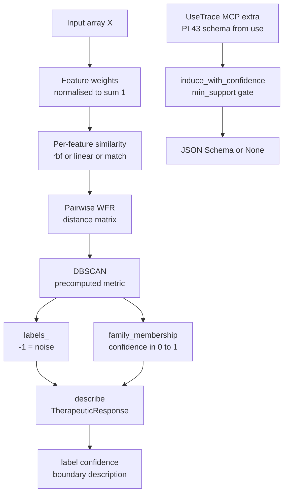

# family-resemblance

> Prototype-free clustering grounded in Wittgenstein's *Philosophical Investigations* §65–67.
> Families form through overlapping pairwise similarities — no centroid, no shared essence.
> [scikit-learn-compatible](https://scikit-learn.org/) estimator.

[](https://github.com/hinanohart/family-resemblance/actions/workflows/ci.yml)
[](https://www.python.org/)
[](https://github.com/hinanohart/family-resemblance/blob/main/LICENSE)
[](https://pypi.org/project/family-resemblance/)

**`family-resemblance`** is a Python library that clusters data without ever picking a centre point. Instead of comparing each sample to a prototype or mean, it builds a pairwise weighted similarity matrix (one per feature), then uses DBSCAN's density-connectivity to grow clusters. When a point sits near a cluster boundary, the library does not invent a confident answer — it returns a `TherapeuticResponse` that honestly reports the limit (PI §133). No language model is involved; all computation is NumPy / scikit-learn.

## Architecture



## Install

```bash
pip install family-resemblance
# optional extras:
pip install "family-resemblance[mcp]"   # MCP schema-from-use helpers
pip install "family-resemblance[viz]"   # matplotlib / seaborn plotting (roadmap)
pip install "family-resemblance[dev]"   # tests, build, twine
```

`pip install family-resemblance` is enough to use `WFRCluster`, the
therapeutic `describe()` helper, and the `fr` CLI. The optional extras are
truly optional — the package imports cleanly without them.

## Quickstart (Python)

```python
import numpy as np
from family_resemblance import WFRCluster, describe

X = np.array([[0.0, 0.0], [0.1, 0.1], [5.0, 5.0], [5.1, 4.9]])
wfr = WFRCluster(eps=0.4, min_samples=2).fit(X)

print(wfr.labels_)               # [0 0 1 1]
print(wfr.family_membership())   # ~[0.99 0.99 0.99 0.99]

for i, lab in enumerate(wfr.labels_):
    r = describe(int(lab), float(wfr.family_membership()[i]))
    print(r.description)
```

## Quickstart (CLI)

```bash
fr version
fr cluster X.csv --eps 0.4 --min-samples 2
fr inspect X.csv --threshold 0.5
```

`fr cluster` emits `{"labels": [...]}`; `fr inspect` emits a list of
`{i, label, confidence, boundary, description}` records.

## Why "family resemblance"?

In §65 of the *Investigations* Wittgenstein objects to the philosophical
search for the essence shared by every member of a category. In §66 he
walks through board games, card games, ball games, video games, and asks
what is common to them all. His answer in §67 is that there is *no* such
common feature — only overlapping similarities, like resemblances within
a family.

This library takes that picture as its data structure. A cluster has no
centre and no prototype: only a weighted aggregation of pairwise
feature-similarities (see [`core/wfr.py`](https://github.com/hinanohart/family-resemblance/blob/main/src/family_resemblance/core/wfr.py)).

No language model is in the loop. Schema induction, family membership,
and the therapeutic boundary check are pure-mechanical (numpy / scikit-learn
/ genson only). The package does not ship, call, or fine-tune an LLM.

## How it works

1. **WFR distance** (`core/wfr.py`): For each pair of samples, compute per-feature similarity using one of three kernels (`rbf`, `linear`, `match`). Apply user-supplied feature weights (renormalised to sum to 1, uniform by default). Average to get a scalar similarity; convert to distance as `1 − similarity`.

2. **WFRCluster** (`core/cluster.py`): Builds the full `(n_samples, n_samples)` precomputed distance matrix, then runs `sklearn.cluster.DBSCAN` on it. No centroid is ever selected. Noise points receive label `-1` (PI §201: rule-following indeterminacy).

3. **Family membership** (`core/cluster.py`): Per-sample confidence is the mean WFR similarity to its cluster neighbours. Noise points have confidence `0.0`.

4. **Therapeutic response** (`core/therapeutic.py`): `describe(label, confidence)` returns a `TherapeuticResponse`. If `confidence < threshold` or `label == -1`, the description cites PI §65–67 / §201 to make the limit explicit rather than issuing a confident but wrong answer.

## Wittgenstein → API map

| PI § | Concept                                  | API surface                                |
| ---- | ---------------------------------------- | ------------------------------------------ |
| §43  | meaning = use                            | `UseTrace` (`[mcp]` extra)                 |
| §65–67 | family resemblance, no shared essence  | `WFRCluster`                               |
| §133 | honest, therapeutic limit                | `describe()` / `TherapeuticResponse`       |
| §201 | rule-following indeterminacy             | DBSCAN noise label `-1`                    |
| §243–315 | private-language argument            | `induce_with_confidence` `min_support` hide gate |

## How is this different from Prototypical Networks?

|                              | Prototypical Networks (Snell+ 2017) | family-resemblance                            |
| ---------------------------- | ----------------------------------- | --------------------------------------------- |
| Cluster representation       | mean / centroid                     | none                                          |
| Membership test              | nearest centroid                    | density-connected via pairwise resemblance    |
| Boundary / low-confidence    | hard nearest assignment             | honest `TherapeuticResponse` (PI §133)        |
| Wittgenstein integration     | none                                | §65–67, §133, §201, §243–315 cited in API     |
| sklearn-compatible           | partial                             | yes (`ClusterMixin + BaseEstimator`)          |
| Distance must be metric      | yes                                 | no — non-transitive resemblance is supported  |
| Per-feature weighting        | learned                             | user-supplied (renormalised); v0.2 will learn |

## Therapeutic mode (PI §133, §201)

`describe()` returns a boundary-aware response:

```python
>>> describe(label=0, confidence=0.3, threshold=0.5).description
'Point assigned to family 0 with confidence 0.30 (< threshold 0.50). The
boundary is genuinely fuzzy (PI §65-67) and no centre defines the family.'

>>> describe(label=-1, confidence=0.0).description
'No family found for this point (DBSCAN noise label). Following PI §201,
no single rule decides its membership.'
```

This is the library's main contribution beyond "clustering with a different
distance function". When the model cannot confidently classify, it does
not invent a missing rule — it reports the limit honestly.

## Optional `[mcp]` extra

The `[mcp]` extra exposes a tiny "schema from use" pipeline (PI §43).
Schemas are not emitted until a tool has been seen at least `min_support`
times — the private-language argument (PI §243–315) refuses to call a
single use a rule:

```python
from family_resemblance._ext.mcp.inducer import induce_with_confidence

schema, conf = induce_with_confidence([{"x": 1}], min_support=3)
# schema is None, conf is 1/3 — refused to emit

schema, conf = induce_with_confidence(
    [{"x": 1}, {"x": 2}, {"x": 3}], min_support=3
)
# schema is a real JSON Schema, conf is 1.0
```

The FastMCP server in `_ext/mcp/server.py` is currently a skeleton; the
full induce-then-replay loop, SQLite-backed `UseTrace` persistence, and
`SchemaCandidate.contradictions` tracking ship in v0.2.

A runnable `examples/mcp_translate_demo.py` is roadmapped for v0.2
alongside the FastMCP transport wiring; until then the snippet above is
the reference demo for the `[mcp]` extra.

## Related work

- **Rosch (1975)** — classical *prototype theory* of categorisation,
  the position this library deliberately rejects by removing centres
  from clusters.
- **arXiv:2601.01127** — *Weighted Family Resemblance Clustering*; the
  pairwise similarity formulation ported in `core/wfr.py`.
- **[LGDL](https://github.com/marcoeg/LGDL)** by Marco Graziano —
  grammar-driven language-game framework. Complementary: LGDL fixes
  grammars up front, whereas `family-resemblance` lets families form
  from observed use.

## License and data

The library is MIT-licensed (see [LICENSE](https://github.com/hinanohart/family-resemblance/blob/main/LICENSE)).

The `data/` directory contains the *Tractatus Logico-Philosophicus*
(Project Gutenberg eBook #5740, US public domain, bilingual: Ogden's 1922
English translation alongside Wittgenstein's German original). See
[`data/PROVENANCE.md`](https://github.com/hinanohart/family-resemblance/blob/main/data/PROVENANCE.md) for full attribution and for the
fair-use policy (≤ 50 words per §, ≤ 250 words across the whole repo) that
governs quotations from *Philosophical Investigations*. The policy is
enforced automatically by
[`tests/test_provenance_policy.py`](https://github.com/hinanohart/family-resemblance/blob/main/tests/test_provenance_policy.py).

## Citation

```bibtex
@software{family_resemblance_0_1,
  author = {runza},
  title  = {family-resemblance: weighted family-resemblance clustering},
  year   = 2026,
  url    = {https://github.com/hinanohart/family-resemblance},
}
```

Algorithmic inspiration: arXiv:2601.01127 (*Weighted Family Resemblance
Clustering*). The §65–67 reading of clustering as overlapping similarities
is, of course, Wittgenstein's.

## Status

v0.1 alpha. See [`CHANGELOG.md`](https://github.com/hinanohart/family-resemblance/blob/main/CHANGELOG.md) for the roadmap.
